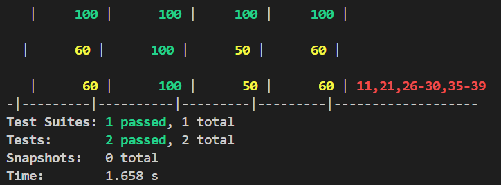

# 📘 Student API Server

A simple RESTful API server built using **Node.js**, **Express**, and **MongoDB** that allows you to perform **CRUD operations** on student records.

---

## 🚀 Technologies Used

* **Node.js**
* **Express.js**
* **MongoDB** (via Mongoose)
* **Postman** (for API testing)

---

## 📂 Project Structure

```
student-api-server/
├── models/
│   └── Student.js
├── routes/
│   └── studentRoutes.js
├── .env
├── server.js
├── package.json
└── README.md
```

---

## 🔧 How to Run the Server Locally

### Prerequisites:

* Node.js and npm installed
* MongoDB running locally (Compass or terminal)

### 1. Clone the Repository

```bash
git clone <your-repo-link>
cd student-api-server
```

### 2. Install Dependencies

```bash
npm install
```

### 3. Create a `.env` File

In the root directory:

```env
MONGODB_URI=mongodb://127.0.0.1:27017/studentdb
PORT=3000
```

### 4. Start MongoDB

Make sure MongoDB is running:

```bash
mongod
```

Or through MongoDB Compass.

### 5. Start the Server

```bash
node server.js
```

You should see:

```
✅ MongoDB Connected
🚀 Server running at http://localhost:3000
```

---

## 📡 API Endpoints

All API endpoints are prefixed with `/api/students`

### 1. ➕ Create a New Student

* **Method**: POST
* **URL**: `/api/students`
* **Body (JSON)**:

```json
{
  "name": "Aa",
  "email": "aa@example.com",
  "course": "CSE",
  "age": 21
}
```

* **Response**: Returns the created student object.

### 2. 📄 Get All Students

* **Method**: GET
* **URL**: `/api/students`
* **Response**: Returns a list of all students.

### 3. ✏️ Update a Student

* **Method**: PUT
* **URL**: `/api/students/:id`
* **Body (JSON)**:

```json
{
  "name": "Ak",
  "email": "ak04@gmail.com",
  "course": "law",
  "age": 22
}
```

* **Response**: Returns the updated student object.

### 4. ❌ Delete a Student

* **Method**: DELETE
* **URL**: `/api/students/:id`
* **Response**: `{ "message": "Student deleted" }`

---

## ✅ Database Used

* **MongoDB** (local instance)
* Database name: `studentdb`
* Collection: `students`

---

## 🧪 How to Test the API

You can use **Postman** to test all endpoints:

* Make a POST request to `/api/students` with student data.
* Use GET to list all students.
* Use PUT with a valid `:id` to update a student.
* Use DELETE with a valid `:id` to remove a student.

That's it! 🎉

#ASSIGNMENT 3
## 🧪 Test Coverage



Achieved ~70% test coverage using Jest & Supertest.

